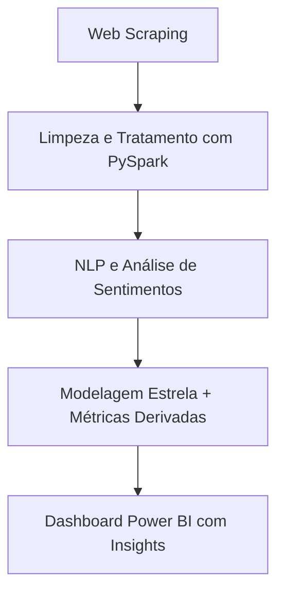

# Escolha de produtos para ações de Marketing baseado em NLP e Análise de percepção dos clientes
# 🐾 Projeto PetLovers

Este projeto é um case fictício baseado em dados reais coletados do Mercado Livre, simulando o cenário de um e-commerce do nicho pet. O objetivo foi aplicar técnicas de Engenharia de Dados e NLP (Processamento de Linguagem Natural) para apoiar a equipe de marketing na tomada de decisões baseadas em dados.

🔗 **Artigo completo no LinkedIn:** [Leia aqui](https://www.linkedin.com/pulse/case-pr%C3%A1tico-projeto-petlovers-dados-reais-nlp-para-frederico-qqmef/?trackingId=ssS3jt0f2iih31xfGgcrfQ%3D%3D)&#x20;

---

## 🚀 Visão Geral do Projeto

**Problema:**\
Como orientar decisões de marketing em um e-commerce pet com base na percepção dos clientes?

**Solução:**\
Análise de avaliações e comentários dos clientes para:

- Identificar produtos com alto potencial de venda
- Propor kits e promoções
- Sugerir retirada de itens com baixa performance
- Detectar sentimentos predominantes por categoria
- Mapear palavras-chave mais mencionadas

---

## 🔄 Pipeline do Projeto



---

## 🛠️ Tecnologias e Ferramentas

| Etapa                  | Ferramentas/Tecnologias            |
| ---------------------- | ---------------------------------- |
| **Coleta de Dados**    | Selenium, Requests, BeautifulSoup  |
| **Tratamento**         | PySpark, Spark SQL                 |
| **NLP/Text Mining**    | Transformers (HuggingFace), SpaCy  |
| **Modelagem de Dados** | Modelo Estrela, Métricas derivadas |
| **Visualização**       | Power BI                           |

---

## 📁 Estrutura do Projeto

```
PetLovers/
├── data/               # Dados brutos e tratados
├── notebooks/          # Exploração inicial e testes
├── src/                # Scripts principais do pipeline
│   ├── scraping/       # Web scraping com Selenium
│   ├── processing/     # Limpeza e transformação com PySpark
│   └── nlp/            # Análise de sentimentos e palavras-chave
├── dashboard/          # Arquivo .pbix do Power BI
├── requirements.txt
└── README.md
```

---

## 📊 Resultados e Insights

- Coleta automatizada de produtos do segmento pet no Mercado Livre
- Análise de sentimentos em comentários reais
- Métricas derivadas: avaliação ponderada, escore de engajamento e custo-benefício
- Dashboard com filtros por marca, categoria e sentimento

> O resultado final permite à equipe de marketing:
>
> - Identificar produtos com alto potencial de venda
> - Avaliar percepção de marca por categoria
> - Criar kits estratégicos e ações promocionais
> - Decidir pela retirada de itens com baixa aceitação

---

## 📚 Aprendizados e Desafios

- Refino do layout visual no Power BI com foco em tomada de decisão
- Aplicação prática de NLP em dados não estruturados
- Modularização de código para automação futura
- Entendimento do valor estratégico de dados reais

---

## 🔮 Próximos Passos

- Automatizar a coleta com **Airflow**
- Validar continuamente os dados coletados
- Criar séries temporais de sentimentos e engajamento

---

## 📘 Artigo Completo

Para mais detalhes, metodologia e storytelling do projeto, acesse:

➡️ [📄 Case Prático no LinkedIn – Projeto PetLovers](https://www.linkedin.com/pulse/case-pr%C3%A1tico-projeto-petlovers-dados-reais-nlp-para-frederico-qqmef/?trackingId=ssS3jt0f2iih31xfGgcrfQ%3D%3D)&#x20;

---

## 👨‍💻 Autor

**Frederico da Costa dos Santos**\
Engenheiro de Dados | NLP | PySpark | Power BI\
🔗 [LinkedIn](https://www.linkedin.com/in/frederico-da-costa-dos-santos/)

